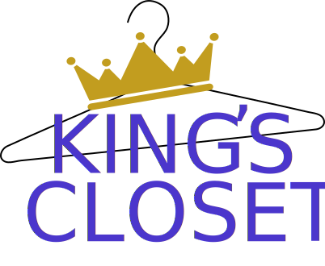

<!-- AUTO-GENERATED-CONTENT:START (STARTER) -->
<p align="center">
  <a href="https://www.kingscloset.org">
    
  </a>
</p>
<h1 align="center">
  King's Closet Public Site
</h1>

## 🎓 What's This Project?

This project was a chance for me to give back and get more experience by redesigning and deploying a website for a local non-profit. I gained valuable experience with React, Gatsby, and Bootstrap 4 while creating this site. I also got more hands-on experience with Github solutions for git, issues, and hosting.

## 🚀 How Do I Contribute or Preview the Site Locally?

1.  **Fork the Repo and download locally.**

1.  **Start developing.**

    Navigate into your the site’s directory and start it up.

    ```shell
    cd kings-closet/
    yarn install
    yarn develop
    ```

1.  **Open the source code and start editing!**

    Your site is now running at `http://localhost:8000`!

    _Note: You'll also see a second link: _`http://localhost:8000/___graphql`_. This is a tool you can use to experiment with querying your data. Learn more about using this tool in the [Gatsby tutorial](https://www.gatsbyjs.org/tutorial/part-five/#introducing-graphiql)._

    Open the `kings-closet` directory in your code editor of choice and edit `src/pages/index.js`. Save your changes and the browser will update in real time!
